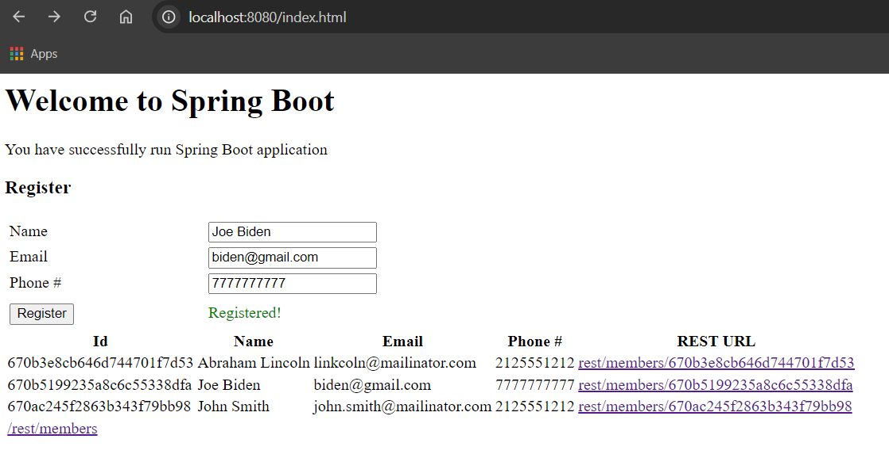

# kitchensink

## How to use
Build, run, open the page

References:

- Migrate JSF to older version of Spring boot https://auth0.com/blog/developing-jsf-applications-with-spring-boot/
- How the original application looks like https://www.youtube.com/watch?v=IfZN5fnOc6w&t=448s
- How to create MongoDB cluster in cloud https://www.youtube.com/watch?v=pEonkyjHd4o

## Video transcript:
Hi everybody,
Please watch this demo video about the migration of Jboss web application to spring boot. 
- Lets look at the requirement of the task:
   The migrated application runtime you must target is the latest stable version of Spring Boot or Quakus (your choice) based on Java 21
- Lets check out the application from Jboss Git repository and see the type of the source application
   The type of the source application is J2EE web application with the extension of the target file WAR. War files cannot
   be run as a regular java application or like spring boot application, but they have to be deployed to the Web container of J2EE compatible
   application server or Web server supporting J2EE web applications.
- Oppositely Spring boot application has embedded Tomcat web container, the web application can be deployed to Tomcat but the
   configuration can be more complex than the configuration of a regular Spring boot application.
- Futhermore the original J2EE application uses outdated technology JSF which may be not supported by the latest versions of Spring boot,
   Java or Web browsers.
- Before migration I tried to find the following topics in the Internet:
  * How to migrate the JSF application to Spring boot.
  * How to run J2EE war application in Jboss 8
- First thing confirmed the libraries needs to be updated and replaced so original JSF libraries are not supported in the latest Spring Boot.
   This leads to the conclusion migration can be complicated by compatibility issues in the libraries.
-  Second when I download the jboss 8 (after the registration on Jboss website) I could not even start the Jboss server to see how the
   original Web application looks like.
-  After reading articles, watching the videos about the application, I decided to simplify the application so it would be 100%
   with the latest versions of the mentioned software and easy to implement within the available amount of time
-  Thus the form, table, xml responses and validation were copied from the original J2EE application while the remaining code was
   rewritten to be compatible with Spring boot
-  I tried to find how to replace React with JSF but figured out the regular JS/ajax solution would be more lightweight for this specific
    migration
-  As result I created the main page based on the original page, and wrote JS script to organize the actions.
-  Application runs successfully with minor differences in UI.
-  After I finished testing with UI I found how to run MonboDB instance for free in a cloud.
-  I watch MongoDB video, created the cluster and configured the connection url
-  After I build the application it successfully connected to the MongoDB server, wrote and read the documents.
    however I had to replace type id to String because autoincrement id in MongoDB represented by Strings compare to relational databases
    where long value used.
